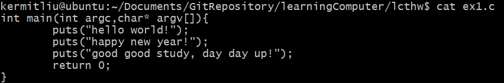
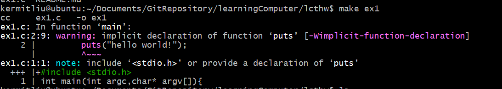
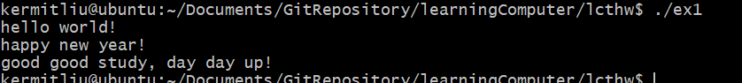

> LCTHW： [Learn C The Hard Way](https://learncodethehardway.org/c/)

> [笨方法学习C(译)](https://wizardforcel.gitbooks.io/lcthw/content/)

> [LCTHW Github](https://github.com/wizardforcel/lcthw-zh)

## 笔记1所包括的范围

- [前言](https://wizardforcel.gitbooks.io/lcthw/content/preface.html)
- [导言](https://wizardforcel.gitbooks.io/lcthw/content/introduction.html)
- [练习0](https://wizardforcel.gitbooks.io/lcthw/content/ex0.html)
- [练习1](https://wizardforcel.gitbooks.io/lcthw/content/ex1.html)
- [练习2](https://wizardforcel.gitbooks.io/lcthw/content/ex2.html)
- [练习3](https://wizardforcel.gitbooks.io/lcthw/content/ex3.html)
- [练习4](https://wizardforcel.gitbooks.io/lcthw/content/ex4.html)


## [前言](https://wizardforcel.gitbooks.io/lcthw/content/preface.html)

期望我能一个月搞定这些教程

## [导言](https://wizardforcel.gitbooks.io/lcthw/content/introduction.html)

所能学到的内容有:

+ C的基本语法和编写习惯。
+ 编译，`make`文件和链接。
+ 寻找和预防bug。
+ 防御性编程实践。
+ 使C的代码崩溃。
+ 编写基本的Unix系统软件。


必须遵守的规则：

+ 手动输入所有代码。**不要复制粘贴！**
+ 正确地输入所有代码，**也包括注释**。
+ 运行代码并保证产生相同的输出。
+ 如果出现了bug则修正它。
+ 做附加题时，如果你做不出某道题，马上跳过。
+ 在寻求帮助之前首先试着自己弄懂。


学习C语言会使你变成更好的程序员，是一门提升程序员核心技能的最佳语言。
C比其它语言都要难，而这是由于C并不对你隐藏细节，它们在其它语言中都试图并且未能被掩盖，实质是其他语言对底层细节进行了进一步的封装，程序员仅仅是调用这些上层的函数即可实现功能。

## [练习0](https://wizardforcel.gitbooks.io/lcthw/content/ex0.html)

我计划使用
+ Linux Ubuntu 24.04.1 LTS (vmware虚拟机x86) 或 Linux UnionTech OS Desktop 20 Pro(真实机器aarch64)
+ vim
+ **警告不要使用IDE**

其中，如何配置vim可以参考这个[链接](https://ysyx.oscc.cc/docs/ics-pa/0.4.html)

IDE，或者“集成开发工具”，它隐藏了背后的细节，你的工作是弄清楚背后发生了什么，对于学习C编程（以及许多其它语言），它们没有意义。

IDE类似于吉他的[TAB（tablature）](https://en.wikipedia.org/wiki/Tablature)，而我们需要学习的是[五线谱](https://en.wikipedia.org/wiki/Staff_(music))

## [练习1](https://wizardforcel.gitbooks.io/lcthw/content/ex1.html)

> 好好学习，天天向上

> 毛泽东

### 编写如下代码到ex1.c中，如图所示：
```c
int main(int argc,char* argv[]){
        puts("hello world!");
        puts("happy new year!");
        puts("good good study, day day up!");
        return 0;
}
```


### 执行命令：
```c
make ex1
```

通过编译的结果来看，存在一个警告，提示我们需要将 #include<stdio.h>添加到代码中

### 未加#include<stdio.h>,运行ex1:


### 添加加#include<stdio.h>,运行ex1:


### 附加题

#### 在你的文本编辑器中打开ex1文件，随机修改或删除一部分，之后运行它看看发生了什么。
ex1是一个[ELF文件](https://en.wikipedia.org/wiki/Executable_and_Linkable_Format)，随机修改或删除一部分，会导致无法运行

#### 再多打印5行文本或者其它比"Hello world."更复杂的东西。
```c
#include<stdio.h>
int main(int argc,char* argv[]){
        puts("hello world!");
        puts("happy new year!");
        puts("good good study, day day up!");
        puts("路曼曼其修远兮，吾将上下而求索");
        puts("萧瑟秋风今又是，换了人间");
        return 0;
}
```

#### 执行man 3 puts来阅读这个函数和其它函数的文档

这个文档包括了 fputc, fputs, putc, putchar, puts函数，用于输出字符和字符串。

SYNOPSIS
       #include <stdio.h>

       int fputc(int c, FILE *stream);
       int putc(int c, FILE *stream);
       int putchar(int c);

       int fputs(const char *restrict s, FILE *restrict stream);
       int puts(const char *s);

DESCRIPTION
       fputc() writes the character c, cast to an unsigned char, to stream.

       putc() is equivalent to fputc() except that it may be implemented as a macro which evaluates stream more than once.

       putchar(c) is equivalent to putc(c, stdout).

       fputs() writes the string s to stream, without its terminating null byte ('\0').

       puts() writes the string s and a trailing newline to stdout.

       Calls to the functions described here can be mixed with each other and with calls to other output functions from the stdio library for the same output stream.

       For nonlocking counterparts, see unlocked_stdio(3).

RETURN VALUE
       fputc(), putc(), and putchar() return the character written as an unsigned char cast to an int or EOF on error.

       puts() and fputs() return a nonnegative number on success, or EOF on error.


## [练习2](https://wizardforcel.gitbooks.io/lcthw/content/ex2.html)


Makefile文件的缩进是一个TAB，下面代码中第四行rm前面是一个 *TAB* ，而不是多个等量的空格。
其中每条规则就明确两件事：构建目标的前置条件是什么，以及如何构建
```bash
<target> : <prerequisites> 
[tab]  <commands>
```

```c
CFLAGS=-Wall -g

clean:
    rm -f ex1

```

```c
#include<stdio.h>
int main(int argc,char* argv[]){
    puts("hello world!");
    puts("happy new year!");
    puts("good good study, day day up!");
    puts("路曼曼其修远兮，吾将上下而求索");
    puts("萧瑟秋风今又是，换了人间");
    puts("仰天大笑出门去，我辈岂是蓬蒿人");
    return 0;
}

```


### 附加题
```c
CFLAGS=-Wall -g

all: ex2

%: %.c
        cc ${CFLAGS} -o $@ $^

.PHONY: clean all

clean:
        rm -rf ex2

```
阅读man make来了解关于如何执行它的更多信息。
阅读man cc来了解关于-Wall和-g行为的更多信息。
在互联网上搜索Makefile文件，看看你是否能改进你的文件。
在另一个C语言项目中找到Makefile文件，并且尝试理解它做了什么。


## [练习3](https://wizardforcel.gitbooks.io/lcthw/content/ex3.html)

```c
#include <stdio.h>

int main()
{
    int age = 10;
    int height = 72;

    printf("I am %d years old.\n", age);
    printf("I am %d inches tall.\n", height);

    return 0;
}

```
```c
CFLAGS=-Wall -g

all: ex3

%: %.c
        cc ${CFLAGS} -o $@ $^

.PHONY: clean all

clean:
        rm -rf ex3

```

直接执行 make clean all


## [练习4](https://wizardforcel.gitbooks.io/lcthw/content/ex4.html)

Valgrind 我之前没有系统学习过，只是零零散散的看到过这个命令。


